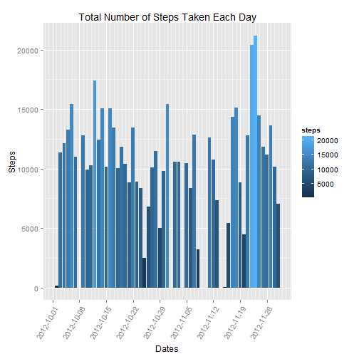
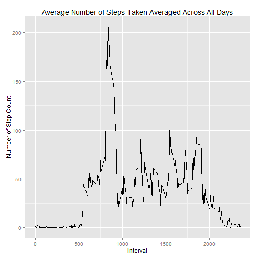
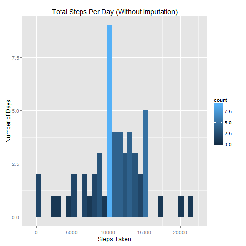
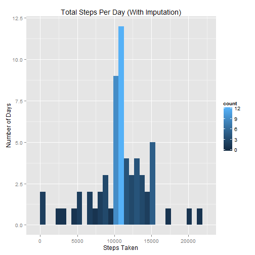
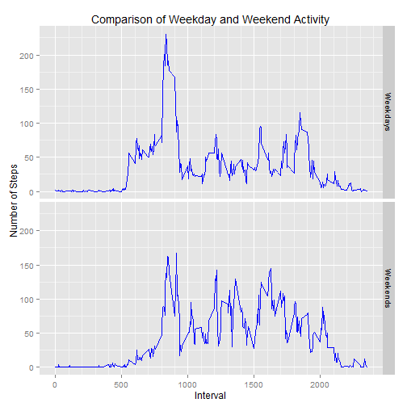

##Introduction
It is now possible to collect a large amount of data about personal movement using activity monitoring devices such as a Fitbit, Nike Fuelband, or Jawbone Up. These type of devices are part of the "quantified self" movement - a group of enthusiasts who take measurements about themselves regularly to improve their health, to find patterns in their behavior, or because they are tech geeks. But these data remain under-utilized both because the raw data are hard to obtain and there is a lack of statistical methods and software for processing and interpreting the data.

This assignment makes use of data from a personal activity monitoring device. This device collects data at 5 minute intervals through out the day. The data consists of two months of data from an anonymous individual collected during the months of October and November, 2012 and include the number of steps taken in 5 minute intervals each day.

##Data

The data for this assignment can be downloaded from the course web site:

Dataset: [Activity Monitoring Data](https://d396qusza40orc.cloudfront.net/repdata%2Fdata%2Factivity.zip)

The variables included in this dataset are:

-   steps: Number of steps taking in a 5-minute interval (missing values are coded as NA)

-   date: The date on which the measurement was taken in YYYY-MM-DD format

-   interval: Identifier for the 5-minute interval in which measurement was taken

The dataset is stored in a comma-separated-value (CSV) file and there are a total of 17,568 observations in this dataset.


## Loading and preprocessing the data

This will load the data into R once all applicable libraries are added


```r
library(plyr)
library(ggplot2)

Orig_Activity_Data <- read.csv("./activity.csv")
##Once the data was loaded, need to make the dates numbers, for graphing purposes
Orig_Activity_Data$date <- as.Date(Orig_Activity_Data$date, format="%Y-%m-%d")
##For the the first set of analyses, removing NA's
NONA_AD<- na.omit(Orig_Activity_Data)
```
## Determining the mean total number of steps taken per day.

```r
## Calculate the total number of steps taken per day
NONA_AD_Totals <- ddply(NONA_AD, c("date"), function(x) colSums(x["steps"]))
head(NONA_AD_Totals)
```

```
##         date steps
## 1 2012-10-02   126
## 2 2012-10-03 11352
## 3 2012-10-04 12116
## 4 2012-10-05 13294
## 5 2012-10-06 15420
## 6 2012-10-07 11015
```

Although the below plot is not required to continue with/complete this analysis, I felt that it was interesting to visualize the number of steps taken each day, across the entire data set.

 

Here we take the analysis one step further by analyzing the total number of steps taken each day; viewed as a histogram.


```r
ggplot(NONA_AD_Totals, aes(x=steps)) + 
    geom_histogram(aes(fill = ..count.., origin=0.1, binwidth=1000)) +
    labs(title="Total Steps Per Day (NAs Removed)") +
    xlab("Steps Taken") +
    ylab("Number of Days")
```

```
## stat_bin: binwidth defaulted to range/30. Use 'binwidth = x' to adjust this.
```

 

Below are the mean and median of the total number of steps taken per day.


```r
mean(NONA_AD_Totals$steps)
```

```
## [1] 10766.19
```

```r
median(NONA_AD_Totals$steps)
```

```
## [1] 10765
```

The next step in the analysis is to create a time series plot of the 5-minute intervals (x-axis) and the average number of steps taken, averaged across 
all days (y-axis).  Performing this analysis will allow us to answer the question; What is the average daily activity pattern? 


```r
NONA_AD_TS <- ddply(NONA_AD,~interval, summarise, mean=mean(steps))

qplot(x=interval, y=mean, data = NONA_AD_TS,  geom = "line",
      xlab="Interval",
      ylab="Number of Step Count",
      main="Average Number of Steps Taken Averaged Across All Days"
      )
```

 

##Identifying which 5-minute interval, on average across all the days in the dataset, contains the maximum number of steps.


```r
NONA_AD_TS[which.max(NONA_AD_TS$Max), ]   
```

```
##     interval      Max
## 104      835 206.1698
```


The 835th time interval contains the maximum number of steps; 206.


Within the next few steps of this process, we are identifying the number of missing values in the dataset, and for these missing values we will "fill" these NAs in with the mean for the respective 5-minute interval. 


```r
Missing_Steps<-sum(is.na(Orig_Activity_Data$steps))
NON_Missing_Steps<-sum(!is.na(Orig_Activity_Data$steps))
NA_NONNA<-cbind(Missing_Steps,NON_Missing_Steps)
NA_NONNA
```

```
##      Missing_Steps NON_Missing_Steps
## [1,]          2304             15264
```

Below we are filling in the NAs in the original data with the mean's of the respective 5-minute interval.  Following this step, comparisons between the original dataset and the filled in data set will be plotted and analyzed using mean and median calculations.


```r
Filled_AD <- Orig_Activity_Data
Filled_AD$steps[is.na(Filled_AD$steps)] <- NONA_AD_TS$mean

Filled_AD_Totals <- ddply(Filled_AD, c("date"), function(x) colSums(x["steps"]))

ggplot(NONA_AD_Totals, aes(x=steps)) + 
    geom_histogram(aes(fill = ..count.., origin=0.1, binwidth=1000)) +
    labs(title="Total Steps Per Day (Without Imputation)") +
    xlab("Steps Taken") +
    ylab("Number of Days")
```

```
## stat_bin: binwidth defaulted to range/30. Use 'binwidth = x' to adjust this.
```

 

```
## stat_bin: binwidth defaulted to range/30. Use 'binwidth = x' to adjust this.
```

 

```
##      Orig_mean Orig_median Imp_mean Imp_median
## [1,]  10766.19       10765 10766.19   10766.19
```

## Comparing Weekdays and Weekends to determine the differences in activity patterns.
The next three steps utilize the weekdays() function to create a new factor variable (with two levels) to separate out the data by weekdays and weekends.


```r
Filled_AD$wday<-(weekdays(Filled_AD$date) 
                 %in% c("Saturday","Sunday"))

Filled_AD$wday<-factor(Filled_AD$wday,labels=c('Weekdays','Weekends'))
```

In order to compare the weekday and weekend levels, panel plots is a great way to visually make this comparison. 


```r
Weekdays_Steps <-aggregate(steps ~ interval + wday
                           , data=Filled_AD[,c(1,3,4)]
                           , FUN=mean)

ggplot(Weekdays_Steps, aes(interval, steps)) +
    geom_line(color='blue') + 
    facet_grid(wday ~ .) + 
    labs(title="Comparison of Weekday and Weekend Activity") +
    labs(x="Interval", y="Number of Steps") +
    scale_x_continuous(minor_breaks = seq(0,3000,100))
```

 
